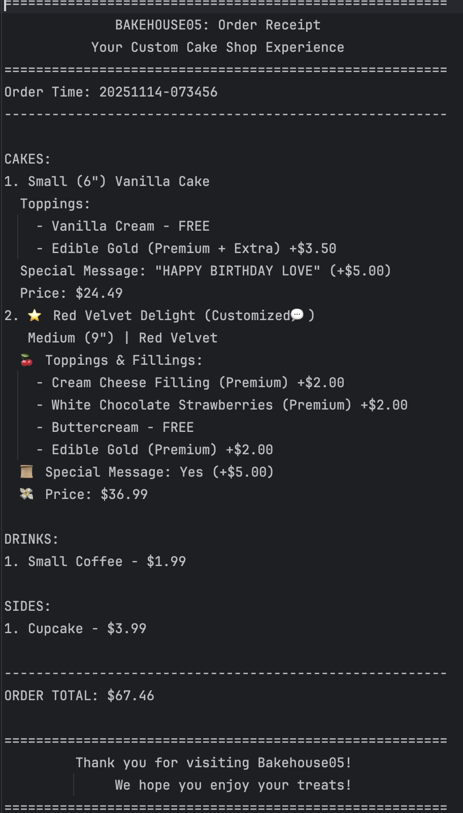

# 🍰 BAKEHOUSE05 - Custom Cake Shop

---

Welcome to BAKEHOUSE05!

A Java Console Application

---
## 📚 Table of Contents

- [📌 About the Project](#-about-the-project)
- [📊 Class Diagram Overview](#-class-diagram-overview)
- [🧁 Features](#-features)
- [🧩 Interesting Code Snippet](#-interesting-code-snippet)
- [🏗 Object-Oriented Structure](#-object-oriented-structure)
- [🧪 Unit Testing](#-unit-testing)
- [▶️ Running the Application](#-running-the-application)
- [📂 Project Structure](#-project-structure)
- [🖼️ Application Screenshots](#-application-screenshots)
- [✍️ Author](#-author)
- [🔗 References](#-references)

--- 

## 💡 About the Project

BakeHouse05 is an interactive Java console application that allows users to create fully customized bakery orders. 
The system supports:
- Custom cakes (size, type, toppings, fillings, special messages)
- Signature cakes with preset configurations 
- Drinks 
- Sides 
- Full order summaries 
- Receipt generation saved as .txt files 
- Input validation 

This project demonstrates object-oriented programming principles including 
    - Abstraction 
    - Inheritance
    - polymorphism
    - Interfaces 
    - Encapsulation
    - Class relationships and design patterns
    - File I/O operations
    - JUnit testing 
while also practicing good architectural structure.

All within a **console-based Java application** with a fun, intuitive interface.

---
## 📊 Class Diagram Overview


---

## 🧁 Features

- **Custom Cakes**
  - Users can select:
  - Cake size
  - Cake flavor
  - Regular or premium toppings
  - Regular or premium fillings
  - Optional custom message (+$5.00)
- **Signature Cakes**
  - Chef-designed cakes with predefined toppings and fillings:
  - Red Velvet Delight
  - Dubai Chocolate Dream
  - Tiramisu Classic
  - Users may still:
  - Remove toppings
  -  Add new toppings/fillings 
  - Add a special message
- **Drinks**
  - Options include:
  - Coffee
  - Tea
  - Milk
  - Juice
  - Sizes: small / medium / large.
- **Sides**
  - Options include:
  - Cupcake
  - Cookie
  - Brownie

- **Order Summary + Receipt Files**
  - Final receipts are saved in:
  - ReceiptData/
  - Each receipt includes:
  - Order timestamp
  - All items grouped by type
  - Individual item details
  - Calculated total
  - Friendly BakeHouse closing message

---
## 🧩 Interesting Code Snippet

- Below is one of the most interesting components of the project: Topping pricing logic, which dynamically adjusts price 
based on whether the topping is regular or premium, and whether the user selects an extra amount.
    ```
        public double getPrice() {
            if (category == ToppingCategory.REGULAR) {
                return isExtra ? 1.50 : 0.00;
            } else {
                // Premium toppings/fillings cost $2.00 each
                // Extra premium costs an additional $1.50
                return isExtra ? 3.50 : 2.00;
            }
        }
    ```
  
- *Why it's interesting*
  - Shows the flexibility of enums (ToppingCategory)
  - Encapsulates pricing rules in one place 
  - Makes topping cost calculations fully automatic 
  - Used throughout both custom and signature cakes

-  This method makes the pricing modular and easy to extend in the future.

---
## 🏗 Object-Oriented Structure
- The application uses several OOP constructs:
- 
- **Interfaces**
  - Price – ensures all products can calculate their price
  - Customizable – ensures all products can return a description
- **Abstract Class**
  - Product – shared fields and behavior for cakes, drinks, sides
- **Enums**
  - CakeSize
  - CakeType
  - DrinkSize
  - DrinkFlavor
  - SideType
  - ToppingCategory
  - SignatureType
- **Polymorphism in Action**
  - Products (Cake, Drink, Side, SignatureCake) are all stored together:
     
    ```
    public void addProduct(Product product) {
      products.add(product);
    }
    ```
    
  - This allows different item types to be treated uniformly in Order.

---
## 🧪 Unit Testing

- **JUnit 5 tests verify**
  - Correct pricing
  - Correct size/flavor/type handling
  - Special message charge
  - Side pricing consistency
- *Example:*

    ```
    @Test
    @DisplayName("Special message adds extra charge")
    void specialMessageAddsExtraCharge() {
        // Arrange
        Cake cake = new Cake(CakeSize.SMALL, CakeType.CHOCOLATE);
        double basePriceOnly = CakeSize.SMALL.getBasePrice();
        double expectedPriceWithMessage = basePriceOnly + 5.00;

        // Act
        cake.setSpecialMessage("Happy Birthday!");
        double actualPrice = cake.calculatePrice();

        // Assert
        assertEquals(expectedPriceWithMessage, actualPrice, 0.01);
    }
    ```
  
---
## ▶️ Running the Application
- **Run the main class**
    ```
    public static void main(String[] args) {
        HomeScreen.showHomeScreen();
    }
    ```
- *The program will open the interactive menu in your console.*

---

## 📂 Project Structure
```
BakeHouse05/
│
├── src/
│   ├── main/
│   │   └── java/
│   │       └── com/
│   │           └── pluralsight/
│   │               └── BakeHouse05/
│   │                   ├── BaseClasses
│   │                   │      ├── Customizable.java
│   │                   │      ├── Price.java
│   │                   │      ├── Product.java
│   │                   │      └── Topping.java
│   │                   ├── ControlRoom      
│   │                   │      ├── BakeHouse05.java
│   │                   │      ├── HomeScreen.java
│   │                   │      ├── ToppingMenu.java
│   │                   │      └── ValidUserInput.java
│   │                   ├── Interface
│   │                   │      └── Display.java
│   │                   ├── Models
│   │                   │      ├── CakeSize.java
│   │                   │      ├── CakeType.java
│   │                   │      ├── DrinkFlavor.java
│   │                   │      ├── DrinkSize.java
│   │                   │      ├── SideType.java
│   │                   │      └── ToppingCategory.java
│   │                   ├── Order
│   │                   │      ├── Order.java
│   │                   │      └── ReceiptsFileManager.java
│   │                   ├── Products
│   │                   │      ├── Cake.java
│   │                   │      ├── Drink.java
│   │                   │      └── Side.java
│   │                   └── SignatureItem
│   │                          ├── SignatureCake.java
│   │                          └── SignatureType.java
│   │
│   └── test/
│       └── java/
│           └── com/
│               └── pluralsight/
│                   └── BakeHouse05/
│                       ├── products
│                       │   ├── CakeTest.java
│                       │   ├── DrinkTest.java
│                       │   └── SideTest.java
│                       └── services
│                           └── OrderTest.java
│
├── ReceiptData/
│   └── yyyyMMdd-HHmmss.txt
│
├── .gitignore
├── README.md
└── pom.xml


```
---
## 🖼️ Application Screenshots

### 🏠Home Screen


### 🧁Custom Cake Screen


### 🧾Receipt Output


### 🖼️ Favorite Code


---

## ✍️ Author

- **Name:** Supreet Kaur
- **Email:** skaur@my.yearupunited.org
- **GitHub:** [GitHub](https://github.com/kaur-stack)
- **LinkedIn:** [Linkedin](https://www.linkedin.com/in/supreet-kaur-892953326/)

---

## 📚 References
Mailjard, R. (2025). Capstone project structure checklist. [Advanced Java OOP – Capstone 2 Guide](https://gist.github.com/RemseyMailjard/e9ab857ca4f92459f40de6d0b75b57fb) Year Up United.

OpenAI. (2025). ChatGPT (GPT-5) [Large language model](https://chatgpt.com).